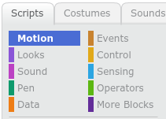

# Red Light! Green Light!

## Rules to Play

- Use the arrow keys to move left and right.
- Try to only move forward when the light is green. 
- If you accidentally walk when the light is red, take three big steps back.

If you make it to the other side, you win!

## Build the Game

### Teach the Cat to walk

Add the following code to the cat sprite, so that it will walk forward and backward when you press the left and right arrow keys.

To find these command blocks, you will need to look in the *Events* and *Motion* script block sections.

The *when left arrow is pressed* command makes the command that follows it only happen when you press the left arrow key on the keyboard. Add this block twice. Select 'left arrow' for the first version, and select 'right arrow' for the second version.

The *move 10* command tells the cat to move a bit in the direction it is facing. It is facing to the right, so it will move right. Add this block twice. 

For the *move 10* block below *when left arrow is pressed* put a minus sign in front of the 10. This tells the cat to take 10 steps back, instead of forward. This code lets you use the left arrow key to take three big steps back when you accidentally step forward on a red light.

### Make the Stop Light

Add a new ball sprite. It will become our stop light.

Add the following code to the ball sprite.

Without the *wait 1 secs* command, our light would change much to fast, making the game too hard. 

-  
-  

These commands change the color of the ball. Different numbers select different colors. I figured out which colors were red and green by trying lots of different numbers. Number 180 makes the ball green. Number 255 makes the ball red.

Enjoy your new game! You can also [Play or Remix my version](https://scratch.mit.edu/projects/170705647/).

# Scribble Bug

Teach Scribble bug how to follow your mouse while he scribbles in fun colors.

## Bug

- If you want to, use the sprite library to change the cat into a bug, or some other animal.
- The links at the left are sets of pictures. The bug I chose is in the *Animals* set.

## Teach the Scribble Bug with Scratch Code

Add the following code to your sprite.

The blocks we want are:
- *when Green Flag clicked* 
- *pen down* 

- *forever*

- *point towards*

- *change pen shade by 10*

- *move 10 steps*

*Pen Down* is a *Pen* script. Find it in the *Pen* section. You may need to scroll down in the scripts window. It tells Scribble Bug to touch the pen down to the page.

*Forever* is a *Control* script. Find it in the *Control* section. It will make the commands inside repeat forever. You will use it to make Scribble Bug follow 
your mouse forever.

*Point Toward* is a *Motion* script. You will use it to tell Scribble Bug to point toward your mouse pointer. Since it goes inside the *Forever* script, Scribble Bug will point toward your mouse forever.

*Change pen shade by 10* is another *Pen* script. It tells scribble bug to change its pen color just a little bit. Since it goes inside the *Forever* script, Scribble Bug will draw a rainbow line!

*Move 10 steps* is another *Motion* script. It tell scribble bug to move forward a little bit. Since it goes inside the *Forever* script, Scribble Bug will always move forward. If we forgot this command, Scribble Bug would forget to move.

## Assemble

Now that you have all the parts, here's the way to assemble them, again.

## Demo

You can copy, remix and enjoy [My Version of Scribble Bug](https://scratch.mit.edu/projects/170692819/), too.

# Starfish Chase!

Make a game where a squid follows your mouse pointer, and starfish run away from the squid.
[To see what it is like, click here to play!](https://scratch.mit.edu/projects/170626313/#player)

## Add the first two sprites.

Start by adding one squid sprite and one starfish sprite.

- The Sprite panel is in the lower left.
- Find and press the *'Add Sprite'* button. It looks like a face.
- 
- You can click the words on the left to explore the sets of sprites. 
- 
- Squid is in the *Underwater* set.
- Find the *Squid* sprite and add *one*.
- Repeat this process to add *one* *Starfish*.

## Code the Squid

Click on the squid sprite and add the following code:

## Code the starfish

Be sure to name the squid sprite 'Squid'. The starfish code below uses this name to decide which sprite to run away from. 

- Right-click on the squid sprite.
- Select 'Info'
- 
- Type the new name 'Squid' in the box that appears.
- 
- Press the back arrow to return to the sprite list.

Click on the starfish sprite and add the following code to make the starfish run away from the squid.

## BONUS! Wandering Starfish

Make the starfish wander around when not chased. 
Click on the starfish sprite and expand the code to match the following.

## BONUS! More Starfish!

If you want more starfish to chase, duplicate the star fish a few times.

		 
 
 ## Play!

Press the *Green Flag* to play your new game!

If you want to play or remix my version, you can find it [here](https://scratch.mit.edu/projects/170626313/).
