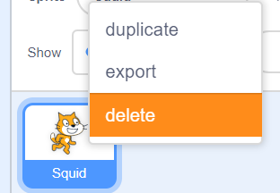

# Answers to some Frequently Asked Questions

- I clicked a new sprite and my code disappeared!
> Don't panic. Click on your other sprites until you find your code blocks. 
- How do I delete a sprite?
> Right click the sprite and select delete. 
- How do I make a "WHEN" block?
> One way is to put a "If Then" block inside of a "Forever" block.
