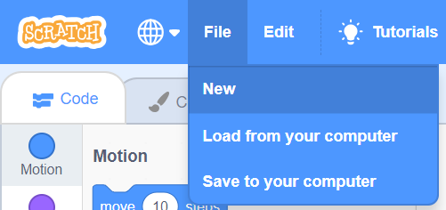

# Answers to some Frequently Asked Questions
- How do I start a new project?
> Find the *New* option in the *File* menu at the top left. 
- I clicked a new sprite and my code disappeared!
> Don't panic. Click on your other sprites until you find your code blocks. 
- How do I delete a sprite?
> Right click the sprite and select delete. 
- How do I make a "WHEN" block?
> One way is to put a "If Then" block inside of a "Forever" block.
- I lost my sprite!
> Under *Motion* double-click the *go to x:0 y:0* block.
> Under *Looks* double-click the *show* block.
> In the Sprite list, right click the sprit and choose *Info*. Make sure the box next to *show* is checked.
> Under *Looks* double-click the *clear graphic effects* block.

