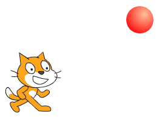
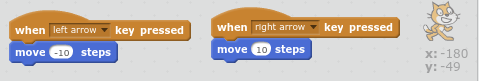
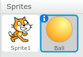

# Red Light! Green Light!

## Rules to Play

Use the arrow keys to move left and right.
Try to only move forward when the light is green. 
If you accidentally walk when the light is red, take three big steps back.

If you make it to the other side, you win!

## Build the Game

### Teach the Cat to walk

Add the following code to the cat sprite, so that it will walk forward and backward when you press the left and right arrow keys.

The *move 10* command tells the cat to move a bit in the direction it is facing. It is facing to the right, so it will move right.

Notice the minus sign in front of the 10 under the left arrow key code. This tells the cat to take 10 steps back, instead of forward. This code lets you use the left arrow key to take three big steps back when you accidentally step forward on a red light.

### Make the Stop Light

Add a new ball sprite. It will become our stop light.

Add the following code to the ball sprite.

Without the *wait 1 secs* command, our light would change much to fast, making the game too hard. 

-  
-  

These commands change the color of the ball. Different numbers select different colors. I figured out which colors were red and green by trying lots of different numbers. Number 180 makes the ball green. Number 255 makes the ball red.

Enjoy your new game! You can also [Play or Remix my version](https://scratch.mit.edu/projects/170705647/).
