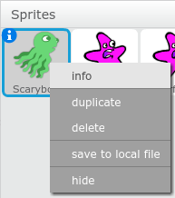
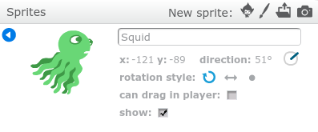

# Starfish Chase!

Make a game where a squid follows your mouse pointer, and starfish run away from the squid.

## Add the first two sprites.

Start by adding a squid sprite and a starfish sprite.

## Code the Squid

Click on the squid sprite and add the following code:

## Code the starfish

Be sure to name the squid sprite 'squid'. The starfish code below uses this name to decide which sprite to run away from. 

- Right-click on the squid sprite.
- Select 'Info'
- Type the new name 'squid' in the box that appears.
- Press the back arrow to return to the sprite list.

Click on the starfish sprite and add the following code:

-

## More Starfish!

If you want more starfish to chase, duplicate the star fish a few times.

 -		 
 
