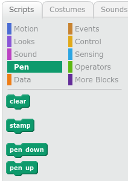
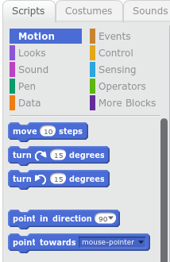

# Scribble Bug

Teach Scribble bug how to follow your mouse while he scribbles in fun colors.

## Bug

- If you want to, use the sprite library to change the cat into a bug, or some other animal.
- The links at the left are sets of pictures. The bug I chose is in the *Animals* set.

## Teach the Scribble Bug with Scratch Code

Add the following code to your sprite.

The blocks we want are:
- Pen Down
- Forever
- Point Toward
- Change pen color by 10
- Move 10 steps

*Pen Down* is a *Pen* script. Find it in the *Pen* section. It tells Scribble Bug to touch the pen down to the page.

*Forever* is a control script. It will make the commands inside repeat forever. You will use it to make Scribble Bug follow 
your mouse forever.

*Point Toward* is a *Motion* script. You will use it to tell Scribble Bug to point toward your mouse pointer. Since it goes inside the *Forever* script, Scribble Bug will point toward your mouse forever.

*Change pen color by 10* is another *Pen* script. It tells scribble bug to change its pen color just a little bit. Since it goes inside the *Forever* script, Scribble Bug will draw a rainbow line!

*Move 10 steps* is another *Motion* script. It tell scribble bug to move forward a little bit. Since it goes inside the *Forever* script, Scribble Bug will always move forward. If we forgot this command, Scribble Bug would forget to move.

