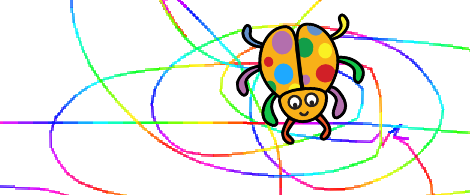
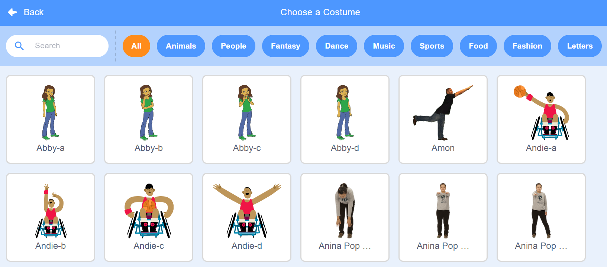
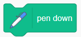
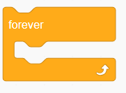
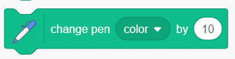
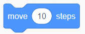

# Lesson 1: Scribble Bug!

Teach Scribble bug how to follow your mouse while he scribbles in fun colors.

## Bug

- If you want to, change the cat into a bug, or some other picture.
- 
- The links at the left are sets of pictures. The bug I chose is in the *Animals* set.
- 

## Teach the Scribble Bug with Scratch Code

The following code blocks will make your bug move.
First we will find each block.
Then we will put them together like this:

## Find the blocks we need

The blocks we need are:
-  *when Green Flag clicked* 
-  *pen down* 
-  *forever*
-  *point towards moust pointer*
-  *change pen color by 10*
-  *move 10 steps*

### 1 Event Block

 

*when Green Flag clicked* is an *Event* block. Find it in the *Events* section. It tells Scribble Bug when to get started.

### 2 Pen Blocks

*Pen Down* is a *Pen* block. Find it in the *Pen* section. You may need to scroll down in the scripts window. It tells Scribble Bug to touch the pen down to the page.

*Change pen shade by 10* is another *Pen* block. It tells scribble bug to change its pen color just a little bit. If we call it enough times, the line becomes a rainbow! The *forever* block will make sure it gets called lots of times.

### 1 Control Block

*Forever* is a *Control* block. Find it in the *Control* section. It makes any blocks inside repeat forever. We will use it to make Scribble Bug follow the mouse forever.

### 2 Motion Blocks

*Point Toward* is a *Motion* block. We will use it to tell Scribble Bug to point toward the mouse pointer. Since it goes inside the *Forever* block, Scribble Bug will point toward the mouse forever.

*Move 10 steps* is another *Motion* block. It tell scribble bug to move forward a little bit. Since it goes inside the *Forever* block, Scribble Bug will always move forward. If we forget this command, Scribble Bug will forget to move.

You can double-click any block to try it out. Some blocks do not do much until they are connected to other blocks. But *Move 10 steps* is a good block to try double-clicking. *Move 10 steps* will make the sprite move a little bit.

## Assemble

Now that we have all the parts, here's the way to put them together:

Drag the blocks with the mouse until they snap together.

## Play!

Congratulations! Press the *Green Flag* to play your new game!

You can also copy, remix and enjoy [My Version of Scribble Bug](https://scratch.mit.edu/projects/170692819/), too.

*Remixes*

- [Smokey Dragon by jdelaporte](https://scratch.mit.edu/projects/171658206/) This version fixes the bouncing when bug catches the mouse pointer. 
