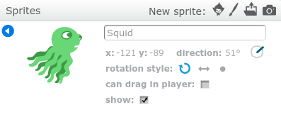
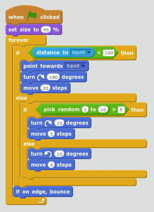

# Starfish Chase!

Make a game where a squid follows your mouse pointer, and starfish run away from the squid.
[To see what it is like, click here to play!](https://scratch.mit.edu/projects/170626313/#player)

## Add the first two sprites.

Start by adding one squid sprite and one starfish sprite.

- The Sprite panel is in the lower left.
- Find and press the *'Add Sprite'* button. It looks like a face.
- 
- You can click the words on the left to explore the sets of sprites. 
- 
- Squid is in the *Underwater* set.
- Find the *Squid* sprite and add *one*.
- Repeat this process to add *one* *Starfish*.

## Code the Squid

Click on the squid sprite and add the following code:

## Code the starfish

Be sure to name the squid sprite 'Squid'. The starfish code below uses this name to decide which sprite to run away from. 

- Right-click on the squid sprite.
- Select 'Info'
- 
- Type the new name 'Squid' in the box that appears.
- 
- Press the back arrow to return to the sprite list.

Click on the starfish sprite and add the following code to make the starfish run away from the squid.

## BONUS! Wandering Starfish

Make the starfish wander around when not chased. 
Click on the starfish sprite and expand the code to match the following.

## BONUS! More Starfish!

If you want more starfish to chase, duplicate the star fish a few times.

		 
 
